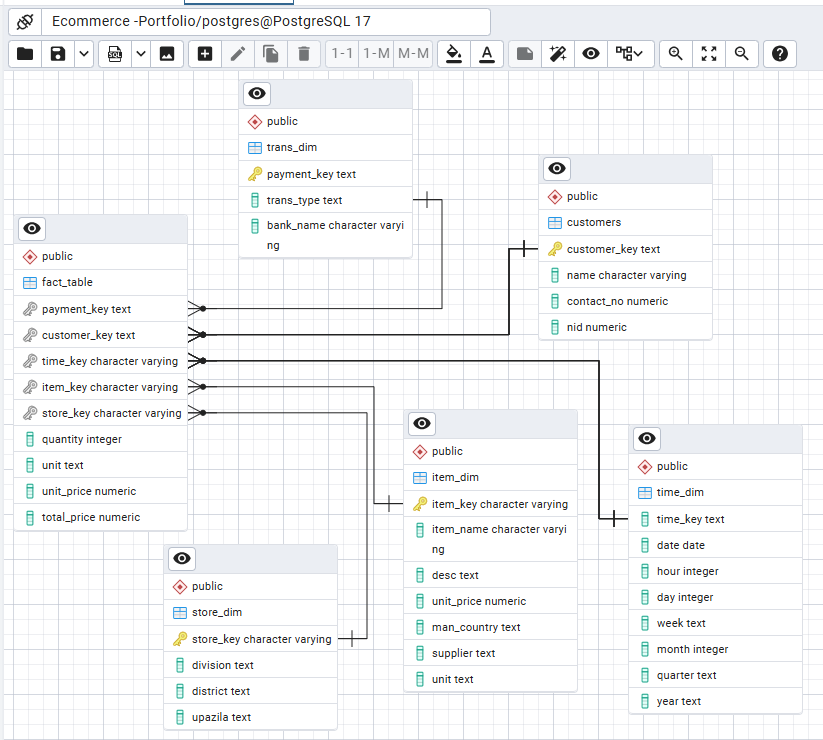
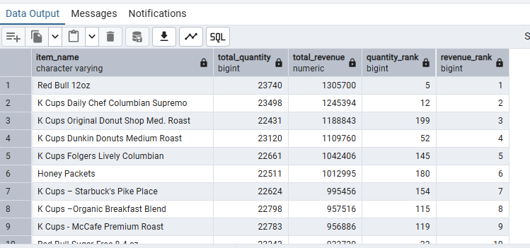
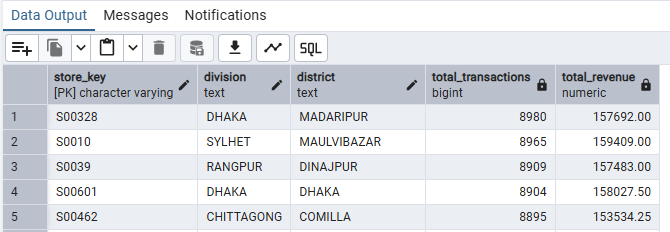

# Sales-Performance-Analysis-with-SQL
## Project Overview
The objective of this analysis is to identify key sales performance drivers across products, customers, suppliers, stores, and time periods. Using SQL, the project uncovers insights that support revenue optimization and operational decision-making.
The analysis is conducted on a star-schema–style dataset consisting of fact and dimension tables (transactions, customers, item, store, and time).

**The Entity Relationship Diagram**




## Business Questions & Analysis
### 1. Best-Performing Products by Sales Volume and Revenue
Business Question: Which products generate the highest sales volume and total revenue?


```sql
WITH product_sales AS (
		SELECT 
 		i.item_name,
		SUM(f.quantity) AS total_quantity,
		SUM(f.total_price) AS total_revenue
 FROM item_dim i
 JOIN fact_table f
 ON i.item_key = f.item_key
 GROUP BY i.item_key, i.item_name
 )
 SELECT 
 	item_name, 
	total_quantity,
	total_revenue,
	RANK() OVER(ORDER BY total_quantity DESC) AS quantity_rank,
	RANK() OVER (ORDER BY total_revenue DESC) AS revenue_rank	
 FROM product_sales
 ORDER BY revenue_rank;
```

**Approach**
I used SQL aggregations to calculate total quantity sold and total revenue per product. Window functions were then applied to rank products by both sales volume and revenue, allowing for identification of top- and bottom-performing products.



**Key Findings:**
- The Top 10 products ranked by total revenue show that Red Bull 12oz is the highest-revenue-generating product.
- Red Bull 12oz is also ranked 5th in sales volume out of over 200 products, indicating strong performance in both revenue and quantity sold.

Changing the final query order to ORDER BY quantity_rank allows identification of the top products based on sales volume instead of revenue.
Focusing on these top-performing products can help improve inventory planning and marketing effectiveness.

### 2. Store Locations with Highest Revenue and Transactions
**Business Question: Which store locations generate the highest revenue and number of transactions?**

```sql
SELECT 
		s.store_key, 
		s.division, 
		s.district,
		SUM(f.quantity) AS total_transactions,
		SUM(f.total_price) AS total_revenue
FROM store_dim s
JOIN fact_table f
ON s.store_key = f.store_key
GROUP BY s.store_key, division, district
ORDER BY total_revenue DESC;
```
**Approach**
I aggregated total transactions (quantity sold) and revenue at the store level and ranked stores and transaction volume to identify high-performing locations.



Key Findings:
- Store S0010 generates the highest total revenue, followed closely by S00601.
- Store S00328 records the highest number of transactions, followed by S0010.
- Store S00601 also performs strongly in transaction volume, ranking among the top stores.
 
Stores S0010 and S00601 consistently rank high across both revenue and transaction metrics, indicating strong overall performance. These stores can be considered benchmark locations for identifying best practices and improving underperforming stores.


### 3. Year-over-Year (YoY) Sales Performance
**Business Question: How does sales performance change year over year?**
