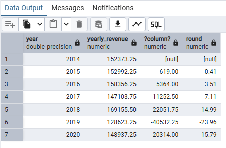
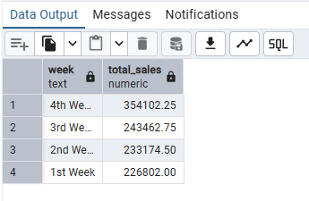
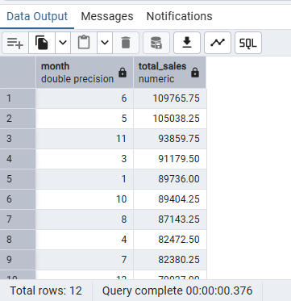
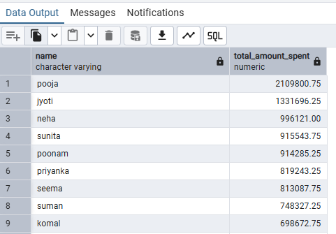
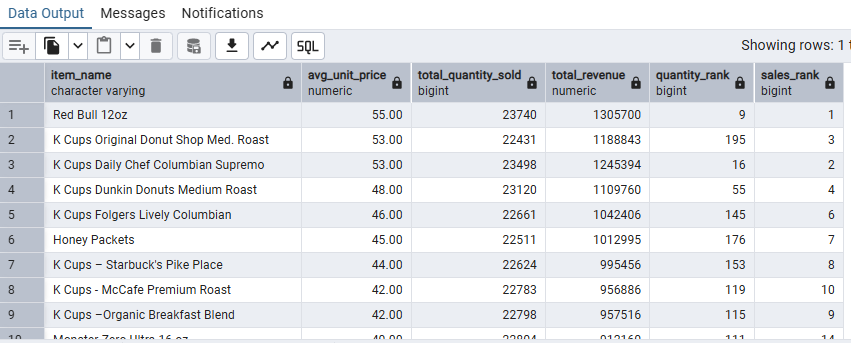
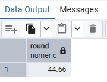
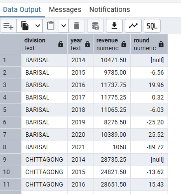

# Sales-Performance-Analysis-with-SQL
## Project Overview
The objective of this analysis is to identify key factors influencing sales performance across products, customers, suppliers, store locations, and time periods. Using SQL, the project uncovers actionable insights that support revenue optimization, operational efficiency, and strategic decision-making.

The analysis is conducted on a star-schema–style dataset consisting of fact and dimension tables, including transactions, customers, items, stores, and time.

**The Entity Relationship Diagram**


## Executive Summary

This project analyzes retail sales data using SQL to uncover key patterns and trends across products, customers, suppliers, store locations, and time periods. By leveraging aggregations, joins, and window functions, the analysis identifies top-performing products and stores, evaluates year-over-year sales trends, examines customer purchasing behavior, and highlights areas of declining performance.

The findings reveal that a small group of products, stores, customers, and suppliers contribute a disproportionate share of total revenue, while sales performance varies significantly across time and locations. Seasonal patterns, pricing dynamics, and repeat purchase behavior were also identified as important factors influencing overall performance.

The insights from this analysis support data-driven recommendations focused on inventory optimization, targeted marketing, customer retention, supplier management, and location-specific performance strategies. Overall, the project demonstrates the ability to translate raw transactional data into actionable business insights using SQL.

## Business Questions & Analysis
### 1. Best-Performing Products by Sales Volume and Revenue
**Business Question: Which products generate the highest sales volume and total revenue?**


```sql
WITH product_sales AS (
		SELECT 
 		i.item_name,
		SUM(f.quantity) AS total_quantity,
		SUM(f.total_price) AS total_revenue
 FROM item_dim i
 JOIN fact_table f
 ON i.item_key = f.item_key
 GROUP BY i.item_key, i.item_name
 )
 SELECT 
 	item_name, 
	total_quantity,
	total_revenue,
	RANK() OVER(ORDER BY total_quantity DESC) AS quantity_rank,
	RANK() OVER (ORDER BY total_revenue DESC) AS revenue_rank	
 FROM product_sales
 ORDER BY revenue_rank
 --we can know underperforming products by revenue, by ordering by qntity rank, we can see product performance by quantitysold.
;
```

**Approach**

I used SQL aggregations to calculate total quantity sold and total revenue per product. Window functions were then applied to rank products by both sales volume and revenue, allowing for identification of top- and bottom-performing products.


**Key Findings:**

- The Top 10 products ranked by total revenue show that Red Bull 12oz is the highest-revenue-generating product.
- Red Bull 12oz is also ranked 5th in sales volume out of over 200 products, indicating strong performance in both revenue and quantity sold.

This indicates strong performance across both pricing and demand. Additionally, ranking products by quantity sold reveals items that sell frequently even if they do not generate the highest revenue.

 **Recommendation**
 
High-performing products like Red Bull 12oz should be prioritized for inventory planning, promotional campaigns, and strategic product placement. Products with high sales volume but lower revenue should be reviewed for pricing or bundling opportunities to maximize profitability.

### 2. Store Locations with Highest Revenue and Transactions
**Business Question: Which store locations generate the highest revenue and number of transactions?**

```sql
SELECT 
		s.store_key, 
		s.division, 
		s.district,
		SUM(f.quantity) AS total_transactions,
		SUM(f.total_price) AS total_revenue
FROM store_dim s
JOIN fact_table f
ON s.store_key = f.store_key
GROUP BY s.store_key, division, district
ORDER BY total_revenue DESC;
```
**Approach**

I aggregated total transactions (quantity sold) and revenue at the store level and ranked stores and transaction volume to identify high-performing locations.


**Key Findings**

- Store S0010 generates the highest total revenue, followed closely by S00601.
- Store S00328 records the highest number of transactions, followed by S0010.
- Store S00601 also performs strongly in transaction volume, ranking among the top stores.
 
Stores S0010 and S00601 consistently rank high across both revenue and transaction metrics, indicating strong overall performance.  

**Recommendation**

Top-performing stores should be used as benchmark locations to identify best practices in operations, staffing, and merchandising. Insights from these stores can be applied to underperforming locations to improve overall store performance.


### 3. Year-over-Year (YoY) Sales Performance
**Business Question: How does sales performance change year over year?**
``` sql
WITH yearly_sales AS (
	SELECT
		DATE_PART('Year', date) AS year,
		SUM(total_price) as yearly_revenue
	FROM complete_data
	GROUP BY DATE_PART('Year', date)
)
SELECT 
	year,
	yearly_revenue,
	yearly_revenue - LAG(yearly_revenue, 1) OVER(ORDER BY year),
	ROUND(((yearly_revenue - LAG(yearly_revenue, 1) OVER(ORDER BY year)) /
	LAG(yearly_revenue, 1) OVER(ORDER BY year) * 100), 2) 
FROM yearly_sales
```

**Approach**

I created a view named complete_data containing sales records from 2014 to 2020 only. This was done to ensure accurate year-over-year comparisons, as data for 2021 was incomplete (January only).
Using this view, I aggregated total revenue by year and applied the LAG() window function within a CTE to calculate Yearly revenue changes and Year-over-year (YoY) growth or decline percentages



**Key Findings**

- Sales remained relatively stable between 2014 and 2016, with gradual growth from ₦152,373.25 in 2014 to ₦158,356.25 in 2016.
- In 2017, revenue declined by 7.11%, indicating a noticeable slowdown in performance.
- 2018 recorded the strongest growth, with revenue increasing by 14.99%, representing the highest year-over-year growth in the period analyzed.
- Sales dropped sharply in 2019, declining by 23.96%, which marks the largest decrease across all years.
- In 2020, revenue recovered by 15.79%, suggesting a partial rebound following the significant decline in 2019.

 **Insight**

Sales performance remained relatively stable from 2014 to 2016, followed by a decline in 2017. The strongest growth occurred in 2018, while 2019 experienced a sharp revenue drop. A recovery in 2020 suggests improved performance after the 2019 downturn, though volatility remains evident.

**Recommendation**

Management should closely monitor year-over-year trends to identify early warning signs of decline. Periods of strong growth, such as 2018, should be analyzed to understand the drivers behind performance improvements and replicate successful strategies during weaker years.

### 4. Weekly and Monthly Sales Trends
**Business Question: Which weeks and months show the strongest sales performance?**

``` sql
--Weekly Sales Trend
SELECT 
	week,
	SUM(total_price) AS total_sales
FROM complete_data
GROUP BY week
ORDER BY 2 DESC;


--Monthly Sales Trend
SELECT 
	DATE_PART('month',date) AS month,
	SUM(total_price) AS total_sales
FROM complete_data
GROUP BY DATE_PART('month',date)
ORDER BY 2 DESC;
```

**Approach**
Using the complete_data view, I aggregated total sales by week of the month and by month to identify periods with the highest sales performance. This helps reveal short-term sales patterns within a month as well as broader monthly trends.





**Key Findings**

**Weekly Sales Trend**
- The 4th week of the month generated the highest sales, with total revenue of 354,102.25.
- Sales gradually increased from the 1st week to the 4th week, indicating stronger customer activity toward the end of the month.

**Monthly Sales Trend**
- June (Month 6) recorded the highest monthly sales, with total revenue of 109,765.75.
- May (Month 5) and November (Month 11) also showed strong performance.
- February (Month 2) and September (Month 9) recorded the lowest sales across the year.
  
**Insight**

Sales consistently peak during the 4th week of each month, indicating increased customer activity toward month-end. On a monthly level, June records the highest sales, while February and September show the weakest performance.

**Recommendation**

Marketing campaigns, promotions, and inventory restocking should be aligned with end-of-month demand spikes. Lower-performing months present opportunities for targeted promotions or seasonal strategies to stabilize revenue throughout the year.


### 5. Highest-Spending Customers
**Business Question: Who are the top-spending customers and how much do they contribute to revenue?**
``` sql
SELECT 
	c.name,
	SUM(f.total_price) AS total_amount_spent
FROM customers c
JOIN fact_table f
	ON f.customer_key = c.customer_key
WHERE c.name IS NOT NULL
GROUP BY c.name
ORDER BY 2 DESC;
```

**Approach**

Customer spending was aggregated and ranked to identify high-value customers.




**Insight**: High-value customers present opportunities for loyalty and retention programs.

**Recommendation**

High-value customers should be targeted with loyalty programs, exclusive offers, and personalized engagement strategies to improve retention and increase lifetime value.


### 6. Product Price vs Performance
**Business Question: How do product prices relate to sales volume and revenue?**

``` sql
WITH product_performance AS (
	SELECT 	
		i.item_name,
		ROUND(AVG(f.unit_price),2) AS avg_unit_price,
		SUM(quantity) AS total_quantity_sold,
		SUM(total_price) AS total_revenue
	FROM item_dim i
	JOIN fact_table f
		ON i.item_key = f.item_key
	GROUP BY item_name	 
)
SELECT
	item_name,
	avg_unit_price,
	total_quantity_sold,
	total_revenue,
	RANK() OVER(ORDER BY total_quantity_sold DESC) AS quantity_rank,
	RANK() OVER(ORDER BY total_revenue DESC) AS sales_rank
FROM product_performance
ORDER BY 2 DESC;
```

**Approach**

 I created a CTE called product_performance to calculate, for each product:
- Average unit price
- Total quantity sold
- Total revenue
  
Using window functions, I ranked products by sales volume and total revenue to compare how pricing relates to overall performance.



**Key Findings**
- Red Bull 12oz is the top-performing product by total revenue, generating 1,305,700, despite ranking 9th in sales volume, showing that higher-priced products can generate strong revenue without being the top in quantity sold
- K Cups Daily Chef Columbian Supremo and K Cups Original Donut Shop Medium Roast also rank very high in total revenue, combining strong pricing with high sales volume.
- Some lower-priced products, such as Pepsi 12 oz cans and Diet Coke 12 oz cans, rank very high in sales volume but do not top the revenue ranking, indicating that high volume does not always translate to the highest revenue.
- Overall, products with higher average unit prices tend to rank higher in revenue, even when their sales volume is not the highest.

**Insight**

Higher-priced products, such as Red Bull 12oz and premium K-Cup variants, generate top revenue even when they are not the highest in sales volume. Conversely, lower-priced products achieve high sales volumes but do not necessarily lead in revenue contribution.

 
**Recommendation**
Product performance should be evaluated using both pricing and volume metrics. Management should consider maintaining premium pricing for high-performing products while exploring upselling or margin optimization strategies for high-volume, low-revenue items.


### 7. Supplier Revenue Contribution
**Business Question: Which suppliers contribute the most revenue?**

``` sql
SELECT 
	supplier,
	SUM(quantity) AS total_quantity,
	SUM(total_price) AS total_revenue,
	RANK()OVER (ORDER BY SUM(quantity) DESC) AS quantity_rank
FROM item_dim i
JOIN fact_table f
	ON i.item_key = f.item_key
GROUP by supplier
ORDER BY 2 DESC;
```

**Approach**
 I aggregated total quantity supplied and total revenue by supplier to evaluate supplier performance. Using a window function, suppliers were ranked based on the total quantity supplied, while revenue figures were used to compare overall financial contribution.


.
- Indo Count Industries Ltd closely follows, contributing 730,625 units and 13,159,323.25 in revenue.
- BIGSO AB, despite ranking 6th in quantity supplied, generated 11,746,920.00 in revenue, showing strong revenue performance relative to volume.
- Overall, the top 10 suppliers contribute a significant portion of total sales, indicating a strong dependence on a relatively small supplier base.

**Insight**

A small number of suppliers account for a significant portion of total sales. While high-volume suppliers generally drive revenue, some suppliers generate strong revenue despite supplying fewer units, indicating higher-value products.


**Recommendation**

Supplier evaluations should consider both volume and revenue contribution. Strong revenue-generating suppliers with lower volumes may warrant closer partnerships, while dependence on a small supplier base highlights the need for supplier risk management and diversification.

### 8. Products with Declining Sales (Year-over-Year)
**Business Question: Which products are experiencing a decline in sales over time based on year-over-year revenue?**

``` sql
WITH yearly_product_performance AS (
	SELECT 
		item_name,
		DATE_PART('Year', date) AS year,
		SUM(total_price) AS total_revenue
	FROM item_dim i
	JOIN fact_table f ON i.item_key = f.item_key
	JOIN time_dim t ON t.time_key = f.time_key
	WHERE DATE_PART('Year', date) != '2021'
	GROUP BY item_name, DATE_PART('Year', date)
	ORDER BY item_name
),
trend AS (
	SELECT 
		item_name,
		year,
		total_revenue,
		LAG(total_revenue,1)OVER(PARTITION BY item_name ORDER BY YEAR) AS prev_year_sale
	FROM yearly_product_performance
)
SELECT
	item_name,
	year,
	total_revenue,
	prev_year_sale
FROM trend
WHERE prev_year_sale IS NOT NULL AND prev_year_sale > total_revenue
;
```

**Approach**

Sales data was aggregated by product and year, and total annual revenue was calculated for each product. The LAG() function was then used to compare each product’s revenue with the previous year’s revenue. Products were identified as declining when their current-year revenue was lower than the prior year, focusing only on years with complete data.


**Key Findings**

- Several products experienced year-over-year declines in revenue, indicating weakening sales performance over time.
- The decline is trend-based rather than random, with some products showing repeated drops across multiple years.
- Some declining products still record high sales volumes, suggesting demand exists but is gradually reducing.
- The presence of declining trends highlights opportunities for pricing review, targeted promotions, or product repositioning.
- Monitoring these products is important to prevent long-term revenue erosion and to support better product portfolio decisions.


**Insight**

Several products show consistent year-over-year revenue declines, suggesting weakening performance over time. Some of these products still maintain relatively high sales volumes, indicating gradual rather than sudden demand erosion.

**Recommendation**

Declining products should be reviewed for pricing adjustments, targeted promotions, or repositioning strategies. Persistent declines may signal the need to phase out certain products and reallocate resources to more stable or growing items.


### 9. Customer Repeat Purchase Behavior
**9. What percentage of customers are repeat buyers, and how many customers purchase more than once?**

``` sql
WITH purchase_days AS (
	SELECT 
		customer_key,
		COUNT(DISTINCT date) AS purchase_days
	FROM fact_table f
	JOIN time_dim t
		ON t.time_key = f.time_key
	GROUP BY customer_key
)
SELECT  
	ROUND((COUNT(*) FILTER (WHERE purchase_days > 1) *100.0) / COUNT(*), 2)
FROM purchase_days
 ;
```

**Approach**

Customer purchase behavior was analyzed by counting the number of distinct purchase days per customer. Customers with more than one purchase day were classified as repeat buyers. The percentage of repeat customers was calculated by dividing the number of repeat buyers by the total number of customers.




**Insight**

Approximately 44.66% of customers are repeat buyers, indicating a moderate level of customer loyalty but also a large proportion of one-time purchasers.

**Recommendation**

Retention initiatives such as loyalty programs, personalized promotions, and post-purchase follow-ups can help increase repeat purchase rates and drive more sustainable revenue growth.


### 10. Which store locations are experiencing the highest year-over-year growth or decline in revenue?

``` sql
WITH store_performance AS (
	SELECT  
		division,
		year,
		SUM(total_price) AS revenue
	FROM store_dim s
	JOIN fact_table f
		ON s.store_key =f.store_key
	JOIN time_dim t
		ON t.time_key = f.time_key
	GROUP BY division, year
) 
SELECT 
	division,
	year,
	revenue,
	ROUND(
	(revenue - LAG(revenue, 1) OVER(PARTITION BY division ORDER BY year))
	/LAG(revenue, 1) OVER(PARTITION BY division ORDER BY year)
	* 100.0,
	2)
FROM store_performance
WHERE year != '2024';
```

**Approach**

Sales revenue was aggregated by store division and year to measure annual performance. Using the LAG() window function, each year’s revenue was compared with the previous year to calculate year-over-year (YoY) growth rates for each store location. The analysis focuses on identifying periods of strong growth as well as significant declines.



**Key Insights**

- Store performance shows significant year-over-year fluctuations across all divisions.
- Rangpur, Rajshahi, and Khulna recorded the strongest growth rates in certain years, indicating periods of strong store performance
- Dhaka and Chittagong, despite having higher absolute revenue, experienced notable declines in some years.
- Most divisions recorded sharp revenue drops in 2021, suggesting reduced operations or incomplete yearly data.
- The mixed performance across locations highlights the importance of store-level strategies rather than a one-size-fits-all approach.


**Insight**

Store divisions exhibit significant year-over-year fluctuations. Some regions demonstrate strong growth in specific years, while others experience notable declines despite higher overall revenue levels.


**Recommendation**

Store performance should be monitored at a location-specific level, allowing management to strengthen strategies in high-growth regions while addressing operational or market challenges in consistently underperforming areas.


## Conclusion

This analysis demonstrates how SQL can be used to transform raw transactional data into actionable business insights. By examining performance across products, customers, suppliers, stores, and time, the project highlights opportunities for revenue optimization, operational improvement, and strategic planning.
