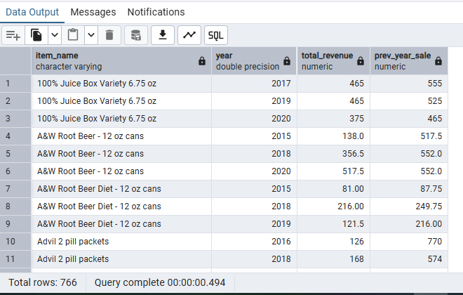

# Sales-Performance-Analysis-with-SQL
## Project Overview
The objective of this analysis is to identify key sales performance drivers across products, customers, suppliers, stores, and time periods. Using SQL, the project uncovers insights that support revenue optimization and operational decision-making.
The analysis is conducted on a star-schema–style dataset consisting of fact and dimension tables (transactions, customers, item, store, and time).

**The Entity Relationship Diagram**


## Business Questions & Analysis
### 1. Best-Performing Products by Sales Volume and Revenue
Business Question: Which products generate the highest sales volume and total revenue?


```sql
WITH product_sales AS (
		SELECT 
 		i.item_name,
		SUM(f.quantity) AS total_quantity,
		SUM(f.total_price) AS total_revenue
 FROM item_dim i
 JOIN fact_table f
 ON i.item_key = f.item_key
 GROUP BY i.item_key, i.item_name
 )
 SELECT 
 	item_name, 
	total_quantity,
	total_revenue,
	RANK() OVER(ORDER BY total_quantity DESC) AS quantity_rank,
	RANK() OVER (ORDER BY total_revenue DESC) AS revenue_rank	
 FROM product_sales
 ORDER BY revenue_rank;
```

**Approach**
I used SQL aggregations to calculate total quantity sold and total revenue per product. Window functions were then applied to rank products by both sales volume and revenue, allowing for identification of top- and bottom-performing products.


**Key Findings:**
- The Top 10 products ranked by total revenue show that Red Bull 12oz is the highest-revenue-generating product.
- Red Bull 12oz is also ranked 5th in sales volume out of over 200 products, indicating strong performance in both revenue and quantity sold.

Changing the final query order to ORDER BY quantity_rank allows identification of the top products based on sales volume instead of revenue.
Focusing on these top-performing products can help improve inventory planning and marketing effectiveness.

### 2. Store Locations with Highest Revenue and Transactions
**Business Question: Which store locations generate the highest revenue and number of transactions?**

```sql
SELECT 
		s.store_key, 
		s.division, 
		s.district,
		SUM(f.quantity) AS total_transactions,
		SUM(f.total_price) AS total_revenue
FROM store_dim s
JOIN fact_table f
ON s.store_key = f.store_key
GROUP BY s.store_key, division, district
ORDER BY total_revenue DESC;
```
**Approach**
I aggregated total transactions (quantity sold) and revenue at the store level and ranked stores and transaction volume to identify high-performing locations.


**Key Findings**
- Store S0010 generates the highest total revenue, followed closely by S00601.
- Store S00328 records the highest number of transactions, followed by S0010.
- Store S00601 also performs strongly in transaction volume, ranking among the top stores.
 
Stores S0010 and S00601 consistently rank high across both revenue and transaction metrics, indicating strong overall performance. These stores can be considered benchmark locations for identifying best practices and improving underperforming stores.


### 3. Year-over-Year (YoY) Sales Performance
**Business Question: How does sales performance change year over year?**
``` sql
WITH yearly_sales AS (
	SELECT
		DATE_PART('Year', date) AS year,
		SUM(total_price) as yearly_revenue
	FROM complete_data
	GROUP BY DATE_PART('Year', date)
)
SELECT 
	year,
	yearly_revenue,
	yearly_revenue - LAG(yearly_revenue, 1) OVER(ORDER BY year),
	ROUND(((yearly_revenue - LAG(yearly_revenue, 1) OVER(ORDER BY year)) /
	LAG(yearly_revenue, 1) OVER(ORDER BY year) * 100), 2) 
FROM yearly_sales
```

**Approach**
I created a view named complete_data containing sales records from 2014 to 2020 only. This was done to ensure accurate year-over-year comparisons, as data for 2021 was incomplete (January only).
Using this view, I aggregated total revenue by year and applied the LAG() window function within a CTE to calculate Yearly revenue changes and Year-over-year (YoY) growth or decline percentages


**Key Findings**
- Sales remained relatively stable between 2014 and 2016, with gradual growth from ₦152,373.25 in 2014 to ₦158,356.25 in 2016.
- In 2017, revenue declined by 7.11%, indicating a noticeable slowdown in performance.
- 2018 recorded the strongest growth, with revenue increasing by 14.99%, representing the highest year-over-year growth in the period analyzed.
- Sales dropped sharply in 2019, declining by 23.96%, which marks the largest decrease across all years.
- In 2020, revenue recovered by 15.79%, suggesting a partial rebound following the significant decline in 2019.

Sales performance fluctuated over the years, with periods of both strong growth and sharp decline. The recovery observed in 2020 indicates improved performance after a weak 2019, highlighting the importance of monitoring year-over-year trends to identify risks early and plan corrective actions.


### 4. Weekly and Monthly Sales Trends
**Business Question: Which weeks and months show the strongest sales performance?**

``` sql
--Weekly Sales Trend
SELECT 
	week,
	SUM(total_price) AS total_sales
FROM complete_data
GROUP BY week
ORDER BY 2 DESC;


--Monthly Sales Trend
SELECT 
	DATE_PART('month',date) AS month,
	SUM(total_price) AS total_sales
FROM complete_data
GROUP BY DATE_PART('month',date)
ORDER BY 2 DESC;
```

**Approach**
Using the complete_data view, I aggregated total sales by week of the month and by month to identify periods with the highest sales performance. This helps reveal short-term sales patterns within a month as well as broader monthly trends.


**Key Findings**

**Weekly Sales Trend**
- The 4th week of the month generated the highest sales, with total revenue of 354,102.25.
- Sales gradually increased from the 1st week to the 4th week, indicating stronger customer activity toward the end of the month.

**Monthly Sales Trend**
- June (Month 6) recorded the highest monthly sales, with total revenue of 109,765.75.
- May (Month 5) and November (Month 11) also showed strong performance.
- February (Month 2) and September (Month 9) recorded the lowest sales across the year.
  
**Insight**
Sales tend to be stronger toward the end of each month, with the 4th week consistently outperforming earlier weeks. On a monthly level, sales peak around mid-year, particularly in June, while some months show noticeably lower performance.


### 5. Highest-Spending Customers
**Business Question: Who are the top-spending customers and how much do they contribute to revenue?**
``` sql
SELECT 
	c.name,
	SUM(f.total_price) AS total_amount_spent
FROM customers c
JOIN fact_table f
	ON f.customer_key = c.customer_key
WHERE c.name IS NOT NULL
GROUP BY c.name
ORDER BY 2 DESC;
```

**Approach**

Customer spending was aggregated and ranked to identify high-value customers.


**Insight**: High-value customers present opportunities for loyalty and retention programs.


### 6. Product Price vs Performance
**Business Question: How do product prices relate to sales volume and revenue?**

``` sql
WITH product_performance AS (
	SELECT 	
		i.item_name,
		ROUND(AVG(f.unit_price),2) AS avg_unit_price,
		SUM(quantity) AS total_quantity_sold,
		SUM(total_price) AS total_revenue
	FROM item_dim i
	JOIN fact_table f
		ON i.item_key = f.item_key
	GROUP BY item_name	 
)
SELECT
	item_name,
	avg_unit_price,
	total_quantity_sold,
	total_revenue,
	RANK() OVER(ORDER BY total_quantity_sold DESC) AS quantity_rank,
	RANK() OVER(ORDER BY total_revenue DESC) AS sales_rank
FROM product_performance
ORDER BY 2 DESC;
```

**Approach**

 I created a CTE called product_performance to calculate, for each product:
- Average unit price
- Total quantity sold
- Total revenue
  
Using window functions, I ranked products by sales volume and total revenue to compare how pricing relates to overall performance.


**Key Findings**
- Red Bull 12oz is the top-performing product by total revenue, generating 1,305,700, despite ranking 9th in sales volume, showing that higher-priced products can generate strong revenue without being the top in quantity sold
- K Cups Daily Chef Columbian Supremo and K Cups Original Donut Shop Medium Roast also rank very high in total revenue, combining strong pricing with high sales volume.
- Some lower-priced products, such as Pepsi 12 oz cans and Diet Coke 12 oz cans, rank very high in sales volume but do not top the revenue ranking, indicating that high volume does not always translate to the highest revenue.
- Overall, products with higher average unit prices tend to rank higher in revenue, even when their sales volume is not the highest.

**Insight**

Product pricing plays a major role in revenue performance. High-priced products can generate top revenue even when they are not the highest in sales volume. This shows the importance of balancing pricing strategy and sales volume when evaluating product performance.


### 7. Supplier Revenue Contribution
**Business Question: Which suppliers contribute the most revenue?**

``` sql
SELECT 
	supplier,
	SUM(quantity) AS total_quantity,
	SUM(total_price) AS total_revenue,
	RANK()OVER (ORDER BY SUM(quantity) DESC) AS quantity_rank
FROM item_dim i
JOIN fact_table f
	ON i.item_key = f.item_key
GROUP by supplier
ORDER BY 2 DESC;
```

**Approach**
 I aggregated total quantity supplied and total revenue by supplier to evaluate supplier performance. Using a window function, suppliers were ranked based on the total quantity supplied, while revenue figures were used to compare overall financial contribution.


.
- Indo Count Industries Ltd closely follows, contributing 730,625 units and 13,159,323.25 in revenue.
- BIGSO AB, despite ranking 6th in quantity supplied, generated 11,746,920.00 in revenue, showing strong revenue performance relative to volume.
- Overall, the top 10 suppliers contribute a significant portion of total sales, indicating a strong dependence on a relatively small supplier base.

Supplier performance differs between volume supplied and revenue generated. While high-volume suppliers tend to drive revenue, some suppliers generate strong revenue with lower quantities, highlighting the importance of evaluating both metrics when managing supplier relationships.


### 8. Products with Declining Sales (Year-over-Year)
**Business Question: Which products are experiencing a decline in sales over time based on year-over-year revenue?**

``` sql
WITH yearly_product_performance AS (
	SELECT 
		item_name,
		DATE_PART('Year', date) AS year,
		SUM(total_price) AS total_revenue
	FROM item_dim i
	JOIN fact_table f ON i.item_key = f.item_key
	JOIN time_dim t ON t.time_key = f.time_key
	WHERE DATE_PART('Year', date) != '2021'
	GROUP BY item_name, DATE_PART('Year', date)
	ORDER BY item_name
),
trend AS (
	SELECT 
		item_name,
		year,
		total_revenue,
		LAG(total_revenue,1)OVER(PARTITION BY item_name ORDER BY YEAR) AS prev_year_sale
	FROM yearly_product_performance
)
SELECT
	item_name,
	year,
	total_revenue,
	prev_year_sale
FROM trend
WHERE prev_year_sale IS NOT NULL AND prev_year_sale > total_revenue
;
```

**Approach**

Sales data was aggregated by product and year, and total annual revenue was calculated for each product. The LAG() function was then used to compare each product’s revenue with the previous year’s revenue. Products were identified as declining when their current-year revenue was lower than the prior year, focusing only on years with complete data.



**Key Findings**

- Several products experienced year-over-year declines in revenue, indicating weakening sales performance over time.
- The decline is trend-based rather than random, with some products showing repeated drops across multiple years.
- Some declining products still record high sales volumes, suggesting demand exists but is gradually reducing.
- The presence of declining trends highlights opportunities for pricing review, targeted promotions, or product repositioning.
- Monitoring these products is important to prevent long-term revenue erosion and to support better product portfolio decisions.

Management can use this insight to review pricing, promotions, or product relevance, and decide whether to revitalize these products or reallocate focus to more stable or growing items.


